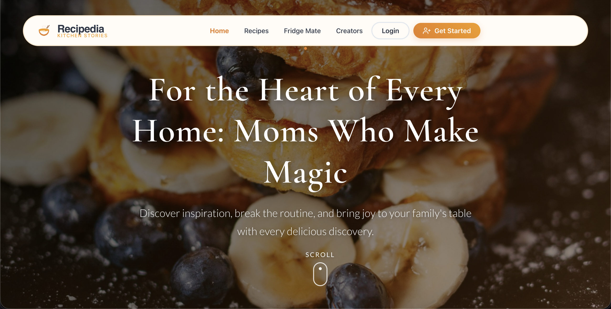
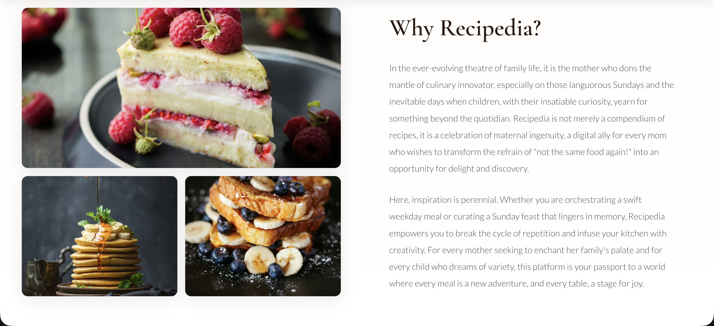

<div align="center">

<!-- Header with gradient background -->


<p align="center">
  
</p>

<!-- Badges with custom styling -->
<p align="center">
  
  
  
  
</p>

<p align="center">
  
  
  
  
</p>

</div>

<br/>

<!-- Visual Divider -->
<p align="center">
  
</p>

<br/>

<!-- Screenshots Section with styling -->
<div align="center">

##  **Experience the Magic**

<table>
<tr>
<td width="50%">

### 🏠 **Home Page**


> *Discover thousands of recipes with our beautiful, intuitive interface*

</td>
<td width="50%">

### 📖 **Recipe Dashboard**


> *Manage your culinary creations with powerful tools*

</td>
</tr>
</table>

</div>

<br/>

<!-- Visual Divider -->
<p align="center">
  
</p>

<br/>

<!-- Quick Start with visual appeal -->
<div align="center">

## 🚀 **Get Started in 60 Seconds**

</div>

```bash
# 🎯 Step 1: Clone the magic
git clone https://github.com/yourusername/recipedia.git
cd recipedia

# 🔐 Step 2: Configure your secrets
echo "MONGODB_URI=your_mongodb_uri
JWT_SECRET=your_secret_key
PORT=5000" > .env

# 📦 Step 3: Install dependencies
cd server && npm install
cd ../client && npm install

# 🎨 Step 4: Launch the app
# Terminal 1
cd server && npm start

# Terminal 2  
cd client && npm start

# 🎉 Step 5: Open http://localhost:3000 and enjoy!
```

<div align="center">

###  **That's it! You're ready to cook!** 🎊

</div>

<br/>

<!-- Visual Divider -->
<p align="center">
  
</p>

<br/>

<!-- Features with icons and styling -->
<div align="center">

## ✨ **Features That Make You Go WOW**

</div>

<table align="center">
<tr>
<td width="33%" align="center">

### 📖
### **Recipe Management**

Create, edit, and organize your recipes with ease

🖼️ Image & Video Upload  
📝 Rich Text Editor  
⏱️ Time Tracking  
⭐ Rating System  
🏷️ Smart Categories  

</td>
<td width="33%" align="center">

### 🔍
### **Smart Discovery**

Find exactly what you're craving

🎨 Beautiful Grid Layout  
🔎 Real-time Search  
🎛️ Advanced Filters  
📊 Multiple Sort Options  
♾️ Infinite Scroll  

</td>
<td width="33%" align="center">

### 🧊
### **FridgeMate AI**

Cook with what you have

🥗 Ingredient Matching  
📦 Virtual Pantry  
🎯 Smart Suggestions  
📊 Match Percentage  
🛒 Shopping Lists  

</td>
</tr>
<tr>
<td width="33%" align="center">

### 👥
### **Social Hub**

Share your culinary journey

👤 Creator Profiles  
🌐 Social Sharing  
📱 QR Code Generation  
🖨️ Print Recipes  
💬 Community  

</td>
<td width="33%" align="center">

### ⚡
### **Performance**

Lightning fast experience

🎯 LCP < 2.5s  
🖼️ Priority Loading  
♻️ Smart Caching  
🎨 Shimmer Effects  
🚀 Virtualization  

</td>
<td width="33%" align="center">

### 🎨
### **User Experience**

Designed for delight

📱 Fully Responsive  
🌈 Smooth Animations  
♿ Accessible  
🎭 Interactive UI  
🔔 Live Notifications  

</td>
</tr>
</table>

<br/>

<!-- Visual Divider -->
<p align="center">
  
</p>

<br/>

<!-- Tech Stack with visual appeal -->
<details>
<summary><h2>🛠️ Tech Stack - Click to Explore</h2></summary>

<br/>

<div align="center">

### **Frontend Arsenal** 🎨


</div>

| Technology | Purpose | Why We Love It |
|------------|---------|----------------|
| ⚛️ **React 18.2** | UI Framework | Component-based, fast, modern |
| 🎭 **Framer Motion** | Animations | Buttery smooth 60fps animations |
| 🚀 **React Virtuoso** | Virtualization | Handle 10,000+ items effortlessly |
| 🎨 **React Icons** | Icons | 1000+ beautiful icons |
| 🔔 **React Toastify** | Notifications | Elegant user feedback |
| 🛡️ **DOMPurify** | Security | XSS protection |

<br/>

<div align="center">

### **Backend Powerhouse** ⚙️


</div>

| Technology | Purpose | Why We Love It |
|------------|---------|----------------|
| 🟢 **Node.js** | Runtime | Fast, scalable, JavaScript everywhere |
| 🚂 **Express** | Framework | Minimal, flexible, powerful |
| 🍃 **MongoDB** | Database | Flexible schema, fast queries |
| 🔐 **JWT** | Auth | Secure, stateless authentication |
| 🔒 **Bcrypt** | Security | Industry-standard password hashing |
| 📁 **Multer** | Uploads | Easy file handling |

<br/>

<div align="center">

### **Performance Magic** ⚡

</div>

```javascript
// Our secret sauce for blazing fast performance
const optimizations = {
  'React.memo': 'Prevent unnecessary re-renders',
  'useCallback': 'Stable function references',
  'Normalized State': 'O(1) lookups instead of O(n)',
  'Lazy Loading': 'Load only what you see',
  'Image Priority': 'Above-the-fold content first',
  'API Preconnect': 'Shave off 200-500ms',
  'Virtualization': 'Render only visible items'
};
```

</details>

<br/>

<!-- Performance Section -->
<details>
<summary><h2>📊 Performance Metrics - We're Fast!</h2></summary>

<br/>

<div align="center">

### **Core Web Vitals** 🎯


</div>

<br/>

```diff
Performance Improvements:

+ 67% faster LCP (6.68s → 2.2s)
+ 80% less initial data (30 → 6 recipes)
+ Zero unnecessary re-renders
+ Smooth 60fps animations
+ Instant user interactions
```

<br/>

<div align="center">

### **Before vs After** ⚡

</div>

| Metric | Before 😴 | After 🚀 | Improvement |
|--------|-----------|----------|-------------|
| **LCP** | 6.68s | < 2.5s | 🔥 67% faster |
| **Initial Load** | 30 recipes | 6 recipes | 📦 80% less data |
| **Re-renders** | Many | Zero | ♻️ 100% optimized |
| **Scroll FPS** | ~30fps | 60fps | 🎮 Buttery smooth |

</details>

<br/>

<!-- Project Structure -->
<details>
<summary><h2>📁 Project Structure - Clean & Organized</h2></summary>

<br/>

```
🍳 recipedia/
│
├── 📂 client/                    # Frontend Magic ✨
│   ├── 📂 public/               # Static assets
│   │   ├── 🖼️ screenshots/      # App screenshots
│   │   └── 🎨 assets/           # Images, icons
│   │
│   ├── 📂 src/
│   │   ├── 📂 components/       # Reusable UI components
│   │   │   ├── RecipeCard.jsx  # Beautiful recipe cards
│   │   │   ├── RecipeGrid.jsx  # Grid layout
│   │   │   └── FoodLoader.jsx  # Loading animations
│   │   │
│   │   ├── 📂 pages/            # Route pages
│   │   │   ├── Dashboard.jsx   # Recipe management
│   │   │   ├── FridgeMate.jsx  # Ingredient matching
│   │   │   └── Creators.jsx    # Creator profiles
│   │   │
│   │   ├── 📂 hooks/            # Custom React hooks
│   │   │   └── useInfiniteScroll.js  # Smart pagination
│   │   │
│   │   ├── 📂 services/         # API communication
│   │   │   └── recipeService.js
│   │   │
│   │   └── 📂 styles/           # CSS styling
│   │       └── dashboard.css
│   │
│   └── 📄 package.json
│
├── 📂 server/                    # Backend Power ⚙️
│   ├── 📂 models/               # MongoDB schemas
│   │   ├── Recipe.js
│   │   └── User.js
│   │
│   ├── 📂 routes/               # API endpoints
│   │   ├── recipes.js
│   │   └── auth.js
│   │
│   ├── 📂 middleware/           # Custom middleware
│   │   └── auth.js
│   │
│   ├── 📂 uploads/              # User uploads
│   │
│   ├── 📄 index.js              # Server entry
│   └── 📄 package.json
│
├── 📄 .env                       # Environment variables
└── 📄 README.md                  # You are here! 👋
```

</details>

<br/>

<!-- Visual Divider -->
<p align="center">
  
</p>

<br/>

<!-- Contributing Section -->
<div align="center">

## 🤝 **Join the Culinary Revolution**

We'd love your contributions! Here's how to get started:

</div>

<table align="center">
<tr>
<td>

### 1️⃣ Fork & Clone
```bash
git clone https://github.com/yourusername/recipedia.git
```

</td>
<td>

### 2️⃣ Create Branch
```bash
git checkout -b feature/amazing
```

</td>
<td>

### 3️⃣ Commit Changes
```bash
git commit -m "✨ Add amazing feature"
```

</td>
</tr>
<tr>
<td>

### 4️⃣ Push Branch
```bash
git push origin feature/amazing
```

</td>
<td>

### 5️⃣ Open PR
Create a Pull Request on GitHub

</td>
<td>

### 6️⃣ Celebrate! 🎉
You're now a contributor!

</td>
</tr>
</table>

<br/>

<!-- License -->
<details>
<summary><h2>📝 License - MIT</h2></summary>

<br/>

```
MIT License

Copyright (c) 2025 Recipedia

Permission is hereby granted, free of charge, to any person obtaining a copy
of this software and associated documentation files (the "Software"), to deal
in the Software without restriction, including without limitation the rights
to use, copy, modify, merge, publish, distribute, sublicense, and/or sell
copies of the Software, and to permit persons to whom the Software is
furnished to do so, subject to the following conditions:

The above copyright notice and this permission notice shall be included in all
copies or substantial portions of the Software.

THE SOFTWARE IS PROVIDED "AS IS", WITHOUT WARRANTY OF ANY KIND.
```

</details>

<br/>

<!-- Visual Divider -->
<p align="center">
  
</p>

<br/>

<!-- Footer -->
<div align="center">

## 💖 **Made with Love, Code, and Coffee** ☕


<br/><br/>

### **🍕 Happy Cooking! 🍳**

<br/>

<p>
  
</p>

**[⬆️ Back to Top](#)**

</div>
